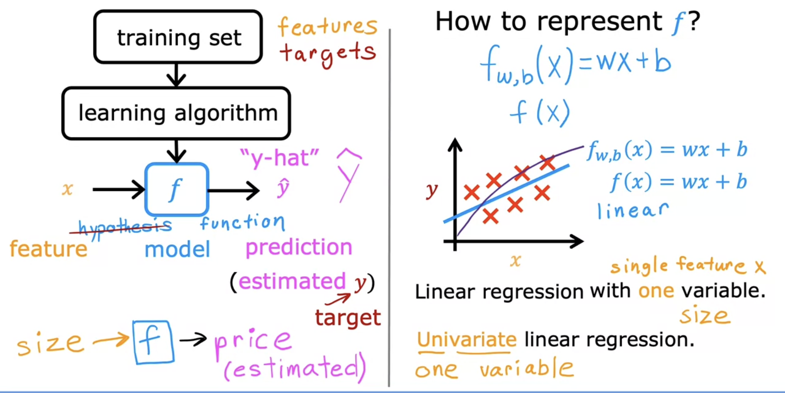
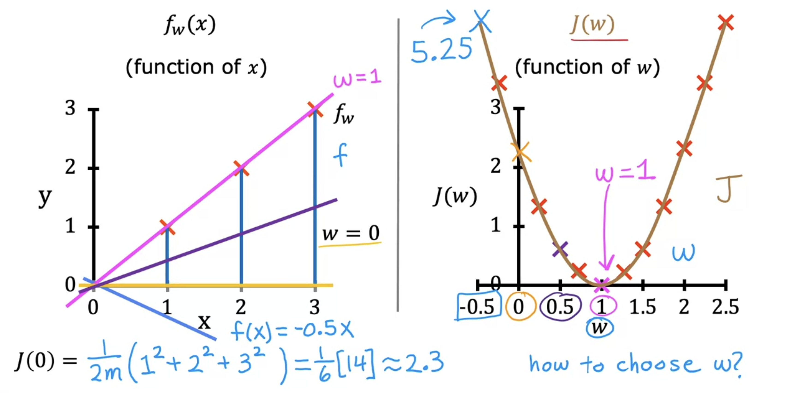
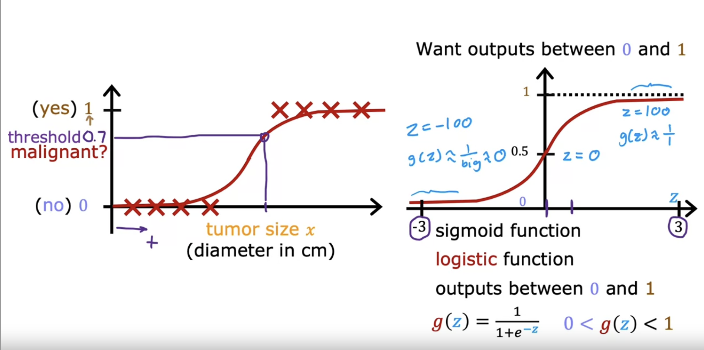

# Supervised Machine Learning

## Week 1: Introduction to Machine Learning

**Learn from data `labeled` with `right answers`**

- **Regression**

  - Predict a `number`
  - `infinitely` many possible outputs
  - **Regression** model predicts **numbers**

- **Classification**

  - Predict `categories`
  - `small numbers` of possible outputs
  - **Classification** model predicts **categories**

  **Training set** - Data used to train the model

- Notation:
  - `x` = "input" variable/features
  - `y` = "output" variable/"target" variable
  - `m` = Number of training examples
  - `(x, y)` = one training example
  - **(x<sup>(i)</sup>, y<sup>(i)</sup>)** = **i<sup>th</sup>** training example
  - **x<sub>j</sub><sup>(i)</sup>** = value of feature `j` in **i<sup>th</sup>** training example

<!--   -->

**Model**: $$y = f_{w,b}(x) = wx + b$$

- `w`, `b`: parameters of the model: weight/coefficient


### Cost function: Squared error cost function

- **Cost function**: Measure the accuracy of our hypothesis function

  - $$J(w,b) = \frac{1}{2m} \sum\limits_{i = 0}^{m} (f_{w,b}(x^{(i)}) - y^{(i)})^2 \tag{1}$$
    - $$ ŷ^{(i)} = f_{w,b}(x^{(i)}) = wx^{(i)} + b \tag{2} $$
    - m: number of training examples
    - reason for `1/2m`: make later calculations look `neater`
  - **Goal**: minimize `J(w,b)`
    - Find w, b that minimize `J(w,b)`

- **Cost function intuition:**
  - **Simplified hypothesis**: $$f_{w,b}(x) = wx$$
    - parameters: `w`
    - cost function: $$J(w) = \frac{1}{2m} \sum\limits_{i = 0}^{m} (wx^{(i)} - y^{(i)})^2 \tag{3}$$
  - **Goal**: minimize `J(w)`
    - Find `w` that minimize `J(w)`

<!--  -->

#### Visualizing cost function

- **Contour plot**
  - x-axis: `w`
  - y-axis: `J(w)`
  - z-axis: `J(w, b)`
  - **Goal**: find the lowest point in the plot


### Gradient descent

1. Have some function `J(w,b)`
2. Want `w, b` that minimize `J(w,b)`
3. Outline:
   1. Start with some `w, b`
   2. Keep changing `w, b` to reduce `J(w,b)`(J is not always bowl-shaped)
   3. until we hopefully end up at a minimum(may have more than one minimum)

#### Gradient descent algorithm

Repeat until convergence:{$$ w = w - \alpha \frac{\partial}{\partial w} J(w,b) \tag{4} $$
$$ b = b - \alpha \frac{\partial}{\partial b} J(w,b) \tag{5} $$}

- `α`: learning rate
  - `α` is too small: slow convergence
  - `α` is too large: may not decrease on every iteration; may not converge
- $$ \frac{\partial}{\partial w} J(w,b) $$
  - Derivative of `J(w,b)` with respect to `w`
    $$ \frac{\partial}{\partial b} J(w,b) $$
  - Derivative of `J(w,b)` with respect to `b`

**`w` and `b` should be updated simultaneously**

Simultaneous update:
$$ tempw = w - \alpha \frac{\partial}{\partial w} J(w,b) \tag{6} $$
$$ tempb = b - \alpha \frac{\partial}{\partial b} J(w,b) \tag{7} $$
$$ w = tempw $$
$$ b = tempb $$

#### Gradient descent intuition

$$ w = w - \alpha \frac{d}{dw} J(w) \tag{8} $$

- **Derivative**: slope of the tangent line
  - **Positive slope**: `w` is too large
  - **Negative slope**: `w` is too small
  - **Zero slope**: `w` is just right

#### Learning rate

$$ w = w - \alpha \frac{d}{dw} J(w) \tag{8} $$

- **Learning rate**: `α`
  - **Too small**: slow convergence
  - **Too large**:
    - may not decrease on every iteration
    - fail to converge, diverge
    - Overshoot and never reach the minimum

Can reach local minimum with fixed learning rate

- Near the local minimum
  - Derivative becomes smaller
  - Update steps become smaller
- Can reach global minimum without decreasing the learning rate

#### Gradient descent for linear regression

Linear regression model:
$$ y = f_{w,b}(x) = wx + b \tag{9} $$
Cost function:
$$ J(w,b) = \frac{1}{2m} \sum\limits_{i = 0}^{m} (f_{w,b}(x^{(i)}) - y^{(i)})^2 \tag{10} $$
Gradient descent algorithm:
repeat until convergence:
{$$ w = w - \alpha \frac{d}{dw} J(w,b) \tag{11} $$
$$ b = b - \alpha \frac{d}{db} J(w,b) \tag{12} $$}

$$
\begin{align}
\frac{d}{dw} J(w,b) &= \frac{d}{dw} \frac{1}{2m} \sum\limits_{i = 0}^{m} (f_{w,b}(x^{(i)}) - y^{(i)})^2 \\
&= \frac{d}{dw} \frac{1}{2m} \sum\limits_{i = 0}^{m} (wx^{(i)} + b - y^{(i)})^2 \\
&= \frac{1}{2m} \sum\limits_{i = 0}^{m} 2(wx^{(i)} + b - y^{(i)})x^{(i)} \\
&= \frac{1}{m} \sum\limits_{i = 0}^{m} (f_{w,b}(x^{(i)}) - y^{(i)})x^{(i)} \tag{13}
\end{align}
$$

$$
\begin{align}
\frac{d}{db} J(w,b) &= \frac{d}{db} \frac{1}{2m} \sum\limits_{i = 0}^{m} (f_{w,b}(x^{(i)}) - y^{(i)})^2 \\
&= \frac{d}{db} \frac{1}{2m} \sum\limits_{i = 0}^{m} (wx^{(i)} + b - y^{(i)})^2 \\
&= \frac{1}{2m} \sum\limits_{i = 0}^{m} 2(wx^{(i)} + b - y^{(i)}) \\
&= \frac{1}{m} \sum\limits_{i = 0}^{m} (f_{w,b}(x^{(i)}) - y^{(i)}) \tag{14}
\end{align}
$$

Gradient descent algorithm:
repeat until convergence:{
$$ w = w - \alpha \frac{1}{m} \sum\limits*{i = 0}^{m} (f*{w,b}(x^{(i)}) - y^{(i)})x^{(i)} \tag{15} $$
$$ b = b - \alpha \frac{1}{m} \sum\limits*{i = 0}^{m} (f*{w,b}(x^{(i)}) - y^{(i)}) \tag{16} $$}

When implement gradient descent on a **convex function**, it is guaranteed to find the `global minimum`

- "Batch" gradient descent
  - Each step of gradient descent uses all the training examples


## Week 2: Regression with multiple input variables

### Multiple features

Model:
$$ f_{w,b}(x) = w_1x_1 + w_2x_2 + ... + w_nx_n + b \tag{1} $$
Notation:

- `n`: number of features
- $$ \vec{w} = \begin{bmatrix} w_1 \\ w_2 \\ \vdots \\ w_n \end{bmatrix}$$
- `b` is a real number
- `w` and `b` are parameters of the model
- $$ \vec{x} = \begin{bmatrix} x_1 \\ x_2 \\ \vdots \\ x_n \end{bmatrix}$$

Now we can rewrite the model as:
$$ f_{\vec{w},b}(\vec{x}) = \vec{w} \cdot \vec{x} + b = w_1x_1 + w_2x_2 + ... + w_nx_n + b \tag{2} $$

### Vectorization

- Without vectorization
  - $$ f_{\vec{w},b}(\vec{x}) = \sum\limits_{j = 1}^{n} w_jx_j + b $$
  
  ```python
  f = 0
  for j in range(n):
    f += w[j] * x[j]
  f += b
  ```

- With vectorization
  - $$ f_{\vec{w},b}(\vec{x}) = \vec{w} \cdot \vec{x} + b $$
  
  ```python
  f = np.dot(w, x) + b
  ```

1. Make code shorter
2. Run faster because of parallelization

### Gradient descent for multiple variables

Cost function:
$$ J(\vec{w},b) = \frac{1}{2m} \sum\limits_{i = 1}^{m} (f_{\vec{w},b}(\vec{x}^{(i)}) - y^{(i)})^2 \tag{3} $$

Gradient descent algorithm:
repeat until convergence:{
$$ w_j = w_j - \alpha \frac{1}{m} \sum\limits_{i = 1}^{m} (f_{\vec{w},b}(\vec{x}^{(i)}) - y^{(i)})x_j^{(i)} \tag{4} $$
$$ b = b - \alpha \frac{1}{m} \sum\limits_{i = 1}^{m} (f_{\vec{w},b}(\vec{x}^{(i)}) - y^{(i)}) \tag{5} $$}
**Simultaneous update**: `w(for j = 1, ..., n)` and `b`

### An alternative to gradient descent

- Normal equation:
  - Only for linear regression
  - Solve for w, b without iteration
  - Disadvantages:
    - Does not generalize to other learning algorithms
    - Slow when number of features is large(more than 10,000)

### Feature scaling

Example:

1. $ 300 <= x_1 <= 2000 $ then $$ \frac{x_1}{2000} $$
2. $ 0 <= x_2 <= 5 $ then $$ \frac{x_2}{5} $$

- $$ x_i = \frac{x_i}{max} $$
- Get every feature into approximately a $ -1 \leq x_i \leq 1 $

### Mean normalization

- $$ x_i = \frac{x_i - \mu_i}{max - min} $$
  - $ \mu_i $ is the average of all the values for feature
    - $$ \mu_i = \frac{1}{m} \sum\limits_{j = 0}^{m-1} x_j^{(i)} $$

### Z-score normalization

- $$ x_j^{(i)} = \frac{x_j^{(i)} - \mu_j}{\sigma_j} $$
  - $ \sigma_i $ is the standard deviation of all the values for feature
    - $$ \sigma_i = \sqrt{\frac{1}{m} \sum\limits_{i = 1}^{m} (x_j^{(i)} - \mu_j)^2} $$
  
### Choosing the learning rate

- Plot $ J(\vec{w},b) $ as a function of the number of iterations of gradient descent
  - If the cost function is not just decreasing, but jumping up and down or even increasing, the reason maybe:
    1. code has bugs
    2. learning rate is too large
With a small *learning rate*, *cost function* should **decrease** on every iteration
    - `Debug`:**Set the learning rate to a very small value, if the algorithm is not working correctly, then try to fix the code**
      - Values of $ \alpha $ to try:
        - ... 0.001 0.003 0.01 0.03 0.1 0.3 1 ...
        - For each value of $ \alpha $ **plot** the cost function, pick the learning rate that causes the cost function to decrease the **fastest** and **consistently**
        - **find a value that is too small and a value that is too large, slowly try to pick the largest possible learning rate**
    - If learning rate is too small, gradient descent can be slow to converge

### Feature engineering

Using `intuition` to design `new features` by transforming or combining the original features

Example:

$$ f_{\vec{w},b}(\vec{x}) = w_1x_1 + w_2x_2 + b $$
If $ x_1 $ is the **frontage** of a house, $ x_2 $ is the **depth** of a house, then $ x_3 = x_1x_2 $ is the **area** of a house
$$ x_3 = x_1x_2 $$ is a new feature
$$ f_{\vec{w},b}(\vec{x}) = w_1x_1 + w_2x_2 + w_3x_3 + b $$

### Polynomial regression

- Linear regression with **higher order** polynomials

Example:

$$ f_{\vec{w},b}(x) = w_0 + w_1x + w_2x^2 + w_3x^3 + b $$

## Week 3: Classification

### Classification with logistic regression

#### logistic regression

- Sigmoid funcion(`logistic function`)
  - output between 0 and 1
  - $$ g(z) = \frac{1}{1 + e^{-z}} ( 0 < g(z) < 1 )$$


pass the value of linear regression into logistic regression

- $$ z = \vec{w} \cdot \vec{x} + b $$
- $$ f_{\vec{w},b}(\vec{x}) = g(z) = \frac{1}{1 + e^{-(\vec{w} \cdot \vec{x} + b)}} $$

Due to **P(y=0) + P(y=1) = 1**

- $$ f_{\vec{w},b}(\vec{x}) = P(y=1 | \vec{x}; \vec{w},b) $$
  - Probability that y = 1, given x, parameterized by w, b

#### Decision boundary

$$ z = \vec{w} \cdot \vec{x} + b = 0 $$

- $$ \vec{w} \cdot \vec{x} + b = 0 $$ is the **decision boundary**
  - We predict y = 1 if $$ \vec{w} \cdot \vec{x} + b \geq 0 $$
  - We predict y = 0 if $$ \vec{w} \cdot \vec{x} + b < 0 $$

### Logistic regression cost function

- Cost function for logistic regression
  - $$ J(\vec{w},b) = \frac{1}{m} \sum\limits_{i = 1}^{m} \frac{1}{2}(f_{\vec{w},b}(\vec{x}^{(i)}) - y^{(i)})^2 $$
    - $$ \frac{1}{2}(f_{\vec{w},b}(\vec{x}^{(i)}) - y^{(i)})^2 = \mathcal{L}(f_{\vec{w},b}(\vec{x}^{(i)}), y^{(i)}) $$
    - **L** is the **loss function**
  - $$ f_{\vec{w},b}(\vec{x}) = \frac{1}{1 + e^{-(\vec{w} \cdot \vec{x} + b)}} $$


- Logistic loss function
  - $
\mathcal{L}(f_{\vec{w},b}(\vec{x}^{(i)}), y^{(i)}) = \begin{cases}
    -log(f_{\vec{w},b}(\vec{x}^{(i)}), & \text{if } y^{(i)} = 1 \\
    -log(1 - f_{\vec{w},b}(\vec{x}^{(i)}), & \text{if } y^{(i)} = 0
\end{cases}
$

So the cost function is

- $$ J(\vec{w},b) = \frac{1}{m} \sum\limits_{i = 1}^{m} \mathcal{L}(f_{\vec{w},b}(\vec{x}^{(i)}), y^{(i)}) $$
  - $$ f_{\vec{w},b}(\vec{x}) = \frac{1}{1 + e^{-(\vec{w} \cdot \vec{x} + b)}} $$

### Simplified cost function

- $$\mathcal L(f_{\mathbf{w},b}(\mathbf{x}^{(i)}), y^{(i)}) = (-y^{(i)} \log\left(f_{\mathbf{w},b}\left( \mathbf{x}^{(i)} \right) \right) - \left( 1 - y^{(i)}\right) \log \left( 1 - f_{\mathbf{w},b}\left( \mathbf{x}^{(i)} \right) \right)$$
  - when $ y^{(i)} = 0$, the left-hand term is eliminated:
$$
\begin{align}
\mathcal L(f_{\mathbf{w},b}(\mathbf{x}^{(i)}), 0) &= (-(0) \log\left(f_{\mathbf{w},b}\left( \mathbf{x}^{(i)} \right) \right) - \left( 1 - 0\right) \log \left( 1 - f_{\mathbf{w},b}\left( \mathbf{x}^{(i)} \right) \right) \\
&= -\log \left( 1 - f_{\mathbf{w},b}\left( \mathbf{x}^{(i)} \right) \right)
\end{align}
$$
  - and when $ y^{(i)} = 1$, the right-hand term is eliminated:
$$
\begin{align}
  \mathcal L(f_{\mathbf{w},b}(\mathbf{x}^{(i)}), 1) &=  (-(1) \log\left(f_{\mathbf{w},b}\left( \mathbf{x}^{(i)} \right) \right) - \left( 1 - 1\right) \log \left( 1 - f_{\mathbf{w},b}\left( \mathbf{x}^{(i)} \right) \right)\\
  &=  -\log\left(f_{\mathbf{w},b}\left( \mathbf{x}^{(i)} \right) \right)
\end{align}
$$

So the cost function can be simplified as

- $$ J(\vec{w},b) = - \frac{1}{m} \sum\limits_{i = 1}^{m} \left[ y^{(i)} \log\left(f_{\vec{w},b}(\vec{x}^{(i)})\right) + (1 - y^{(i)}) \log\left(1 - f_{\vec{w},b}(\vec{x}^{(i)})\right) \right] $$
  - $$ f_{\vec{w},b}(\vec{x}) = \frac{1}{1 + e^{-(\vec{w} \cdot \vec{x} + b)}} $$

The reason to choose this cost function is that it is **convex**.

### Gradient descent for logistic regression

$$ J(\vec{w},b) = - \frac{1}{m} \sum\limits_{i = 1}^{m} \left[ y^{(i)} \log\left(f_{\vec{w},b}(\vec{x}^{(i)})\right) + (1 - y^{(i)}) \log\left(1 - f_{\vec{w},b}(\vec{x}^{(i)})\right) \right] $$
repeat {
$$ w_j = w_j - \alpha \frac{\partial J(\vec{w},b)}{\partial w_j}  \text{(for j = 0..n-1)} $$
$$ b = b - \alpha \frac{\partial J(\vec{w},b)}{\partial b} $$
} simultaneously update all $ w_j $ and $ b $

$$ \frac{\partial J(\vec{w},b)}{\partial w_j} = \frac{1}{m} \sum\limits_{i = 1}^{m} \left( f_{\vec{w},b}(\vec{x}^{(i)}) - y^{(i)} \right) x_j^{(i)} $$
$$ \frac{\partial J(\vec{w},b)}{\partial b} = \frac{1}{m} \sum\limits_{i = 1}^{m} \left( f_{\vec{w},b}(\vec{x}^{(i)}) - y^{(i)} \right) $$

- Linear regression: $ f_{\vec{w},b}(\vec{x}) = \vec{w} \cdot \vec{x} + b $
- logistic regression: $ f_{\vec{w},b}(\vec{x}) = \frac{1}{1 + e^{-(\vec{w} \cdot \vec{x} + b)}} $
- Same concepts:
  - Monitor gradient descent(learning curve) to make sure it is converging
  - Vectorized implementation
  - Feature scaling
